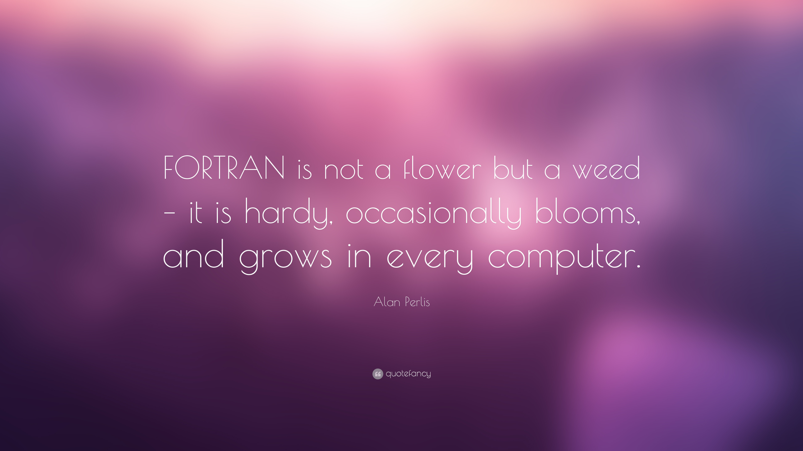

# Curso de programación en Fortran

[][1]
[![GNU General Public License][2]][1] [![Fortran][3]][1] [![Python][4]][1] [![C++][5]][1] [![LaTeX][6]][1] [![Jupyter Notebook][7]][1] [![Programming][8]][1] [![Teaching][9]][1] [![Physics][10]][1]

Materiales de clases para la enseñanza del lenguaje de programación Fortran que empleo en mis cursos de capacitación.

Los cursos generalmente de dividen en sesiones de nivel básico, intermedio y avanado dependiendo de la profundidad con la que cada tópico sea tratado y la complejidad del mismo.

El material y los ejemplos desarrollados estan orientados a aplicaciones físicas ya sea instrumentación, procesamiento de datos o modelamiento y simulaciones.

## Autor

* [@zodiacfireworks](https://github.com/zodiacfireworks)

## Licencia

Todos los recursos desarrollados por mí en este repositorio son puestos a disposición del publico bajo la linencia GNU GLPv3.0 (Véase el archivo LICENSE)

Los recursos con sus respectivas licencias son protegidos por las mismas.

Si usted encuentra contenido protegido por derechos de autor o sin sus respectivos cŕeditos, por favor, hágamelo saber para pnerl el orden de acuerdo a ley.

[1]: https://github.com/zodiacfireworks/course--fortran
[2]: https://img.shields.io/badge/License-GNU%20GPL-blue.svg?maxAge=2592000&style=flat-square
[3]: https://img.shields.io/badge/Language-Fortran-brown.svg?maxAge=2592000&style=flat-square
[4]: https://img.shields.io/badge/Language-Python-yellow.svg?maxAge=2592000&style=flat-square
[5]: https://img.shields.io/badge/Language-C++-blue.svg?maxAge=2592000&style=flat-square
[6]: https://img.shields.io/badge/Language-LaTeX-lightgrey.svg?maxAge=2592000&style=flat-square
[7]: https://img.shields.io/badge/Tool-Jupyter%20Notebook-orange.svg?maxAge=2592000&style=flat-square
[8]: https://img.shields.io/badge/Topic-Programming-4a148c.svg?maxAge=2592000&style=flat-square
[9]: https://img.shields.io/badge/Topic-Teaching-blue.svg?maxAge=2592000&style=flat-square
[10]: https://img.shields.io/badge/Topic-Physics-green.svg?maxAge=2592000&style=flat-square
